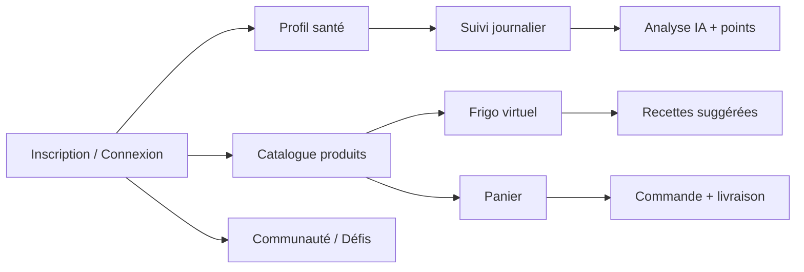

# Architecture — HappyBite

## Vue d'ensemble

HappyBite suit une architecture **PHP native en couches** (sans framework) :

```
Navigateur
    │
    ▼
FrontOffice/  ou  BackOffice/     ← Pages PHP (vues + routage léger)
    │
    ▼
Controllers/                       ← Logique métier, validation, orchestration
    │
    ▼
Models/  +  config/Database.php   ← Accès données (PDO)
    │
    ▼
MySQL (happybite)
```

## Modules principaux

### Front Office (`FrontOffice/`)

| Module | Fichiers clés | Rôle |
|--------|---------------|------|
| Catalogue | `List-Produit.php`, `List-Recette.php` | Produits, recettes, catégories |
| Panier & commande | `panier.php`, `commande.php`, `track.php` | Achat, paiement simulé, suivi livraison |
| Santé | `sante.php`, `user_health_space.php`, `createSuivi.php` | Profil santé, suivi journalier, points |
| Frigo | `List-Frigo.php` | Inventaire virtuel, suggestions recettes |
| Communauté | `Communaute.php` | Posts, stories, likes, commentaires |
| Défis | `challenge_du_jour.php`, `fortune_wheel_spin.php` | Challenges nutritionniste, roue, gagnants |
| IA | `Ai.php`, `ai_chat.php` | Assistant conversationnel |
| Auth | `auth/login.php`, `auth/register.php` | Connexion, inscription, Face ID |
| Profil | `Profile_Utilisateur.php` | Paramètres, photo, mot de passe |

### Back Office (`BackOffice/`)

| Module | Fichiers clés | Rôle |
|--------|---------------|------|
| Dashboard | `dashboard.php`, `main.php` | Tableau de bord admin |
| CRUD | `List-Produit.php`, `List-Recette.php`, `users.php`… | Gestion catalogue et utilisateurs |
| Commandes | `list-com-liv.php`, `Edit-commande.php` | Commandes et livraisons |
| Challenges | `dashboard_challenges.php` | Administration des défis |
| Communauté | `dashboard_posts.php`, `list_commentaires.php` | Modération |

### Contrôleurs (`Controllers/`)

Couche centrale réutilisée par le Front et le Back Office :

- `ProduitController`, `RecetteController`, `CategorieController` — catalogue
- `CommandeController`, `LivraisonController` — e-commerce
- `FrigoController`, `ProfilSanteController`, `SuiviJournalierController` — santé
- `PostController`, `StoryController`, `CommentaireController` — social
- `ChallengeController`, `ChallengeService`, `AIValidationService` — gamification
- `GeminiController`, `ControllerIA`, `AiAssistantContext` — intelligence artificielle
- `AuthProcess`, `AuthFaceSupport` — authentification
- `UserNotificationService`, `MailService` — notifications et e-mail

### Configuration (`config/`)

| Fichier | Rôle |
|---------|------|
| `Database.php` | Singleton PDO, variables `DB_*` |
| `secrets.example.php` → `secrets.php` | Clés OpenAI / Gemini |
| `mail.example.php` → `mail.php` | SMTP Gmail (optionnel) |
| `openai_key.php` | Chargeur de clés API |

## Flux utilisateur type



## Sécurité

- Mots de passe hashés (`password_hash` / `password_verify`)
- Sessions séparées Front Office / Back Office
- Clés API hors dépôt Git (`config/secrets.php`, `.gitignore`)
- Rôles utilisateur : `admin`, `client`, `nutritionniste`, `fournisseur`
- Back Office réservé au rôle `admin`

## Internationalisation

- Fichiers de traduction : `FrontOffice/lang/fr.php`, `en.php`
- Helper : `FrontOffice/includes/fo_i18n.php`
- Préférences utilisateur : table `settings` (langue, thème)
