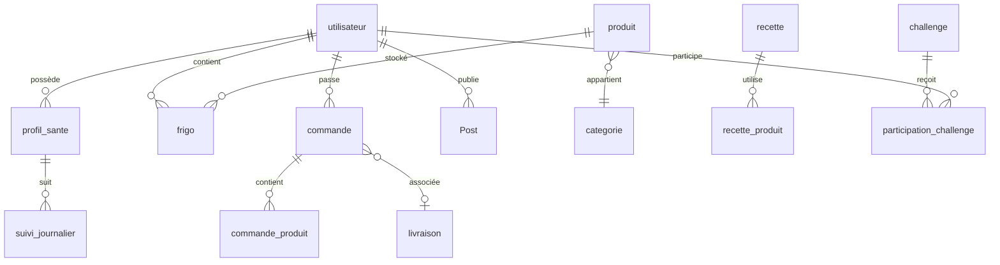

# Base de données — HappyBite

## Informations générales

| Propriété | Valeur |
|-----------|--------|
| Nom | `happybite` |
| Moteur | InnoDB |
| Charset | `utf8mb4_unicode_ci` |
| Connexion | `config/Database.php` (PDO) |

## Schéma relationnel (simplifié)

## Tables principales

| Table | Description |
|-------|-------------|
| `utilisateur` | Comptes (auth, rôles, photo, Face ID) |
| `categorie`, `produit`, `recette` | Catalogue alimentaire |
| `frigo` | Stock virtuel par utilisateur |
| `profil_sante`, `suivi_journalier` | Module santé |
| `commande`, `commande_produit`, `livraison` | E-commerce |
| `Post`, `Commentaire`, `Story` | Communauté |
| `challenge`, `participation_challenge` | Défis nutritionniste |
| `user_notification`, `settings` | Notifications et préférences UI |
| `webauthn_credentials` | Authentification biométrique |

## Installation

Voir [`database/README.md`](../database/README.md) pour l'ordre d'import des scripts SQL.

**Script principal :** `database/schema.sql` (crée la base et les tables catalogue)

**Données de test :** `database/seed_demo.sql` (admin + catégories + produits exemple)

## Migrations

Les fichiers `migration_*.sql` ajoutent des colonnes ou tables sans casser l'existant. Ils sont idempotents quand c'est possible (`IF NOT EXISTS`, `ADD COLUMN IF NOT EXISTS`).

## Compte de démonstration

Après import de `seed_demo.sql` :

| Rôle | E-mail | Mot de passe |
|------|--------|--------------|
| Admin | admin@happybite.tn | password |
| Fournisseur | fournisseur@happybite.tn | password |
| Nutritionniste | nutritionniste@happybite.tn | password |
